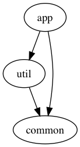

# gradle2dot

Basic Kotlin application that processes a Gradle project's dependency graph and generates a simple [Graphviz] file.

## Usage

### Distribution

If you [build](#build) the distribution package, then you can run `gradle2dot` as follows:

```
./gradle2dot GRADLE_PROJECT_DIRECTORY [OUTPUT_FILE.DOT]
```

If the `OUTPUT_FILE.DOT` argument is omitted, then `gradle2dot` will write to standard output.

### Gradle

Alternatively, `gradle2dot` can be run via the Gradle `run` task (with arguments passed via `-Dexec.args`):

```shell
./gradlew run --quiet -Dexec.args="example/" | dot -Tpng -o example.png
```

## Example

Assuming you had a Gradle project with the following structure and file contents:

```gradle
// example/settings.gradle

include ':app'
include ':util'
include ':common'
```

```gradle
// example/app/build.gradle

dependencies {
    implementation project(':util')
    implementation project(':common')
}
```

```gradle
// example/util/build.gradle

dependencies {
    implementation project(':common')
}
```

```gradle
// example/common/build.gradle

dependencies {}
```

You could then produce a [Graphviz] dependency graph via:

```shell
./gradle2dot example/ | dot -Tpng -o example.png
```



## Build

To create a distribution package in `zip` format, run:

```shell
./gradlew distZip
```

The package will be placed in the `build/distributions` directory.

## Dependencies

- [JRE 8]
- [Graphviz]

### Homebrew

If you have [brew], then you can install [Graphviz] via:

```shell
brew install graphviz
```


[Graphviz]: http://www.graphviz.org/
[JRE 8]: http://www.oracle.com/technetwork/java/javase/downloads/jre8-downloads-2133155.html
[brew]: https://brew.sh/